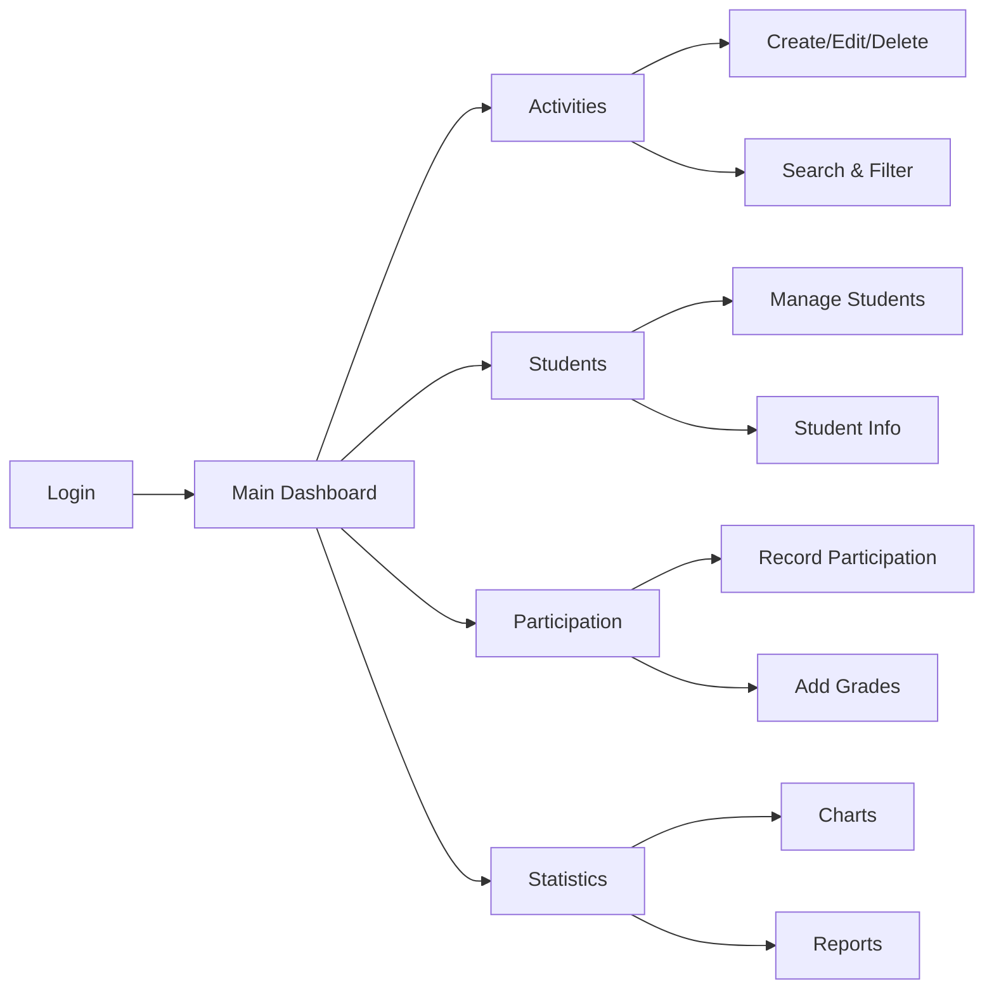
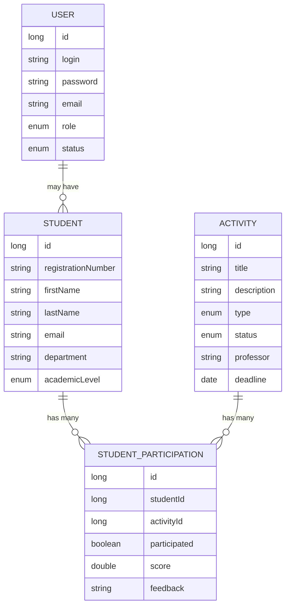
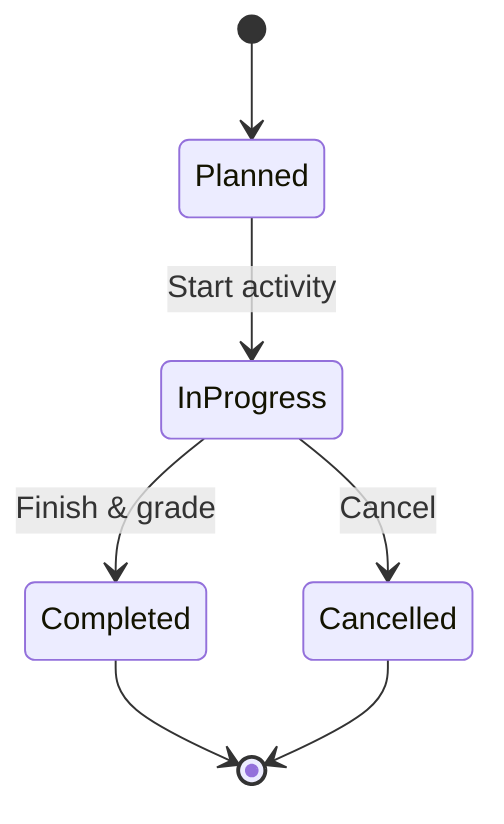
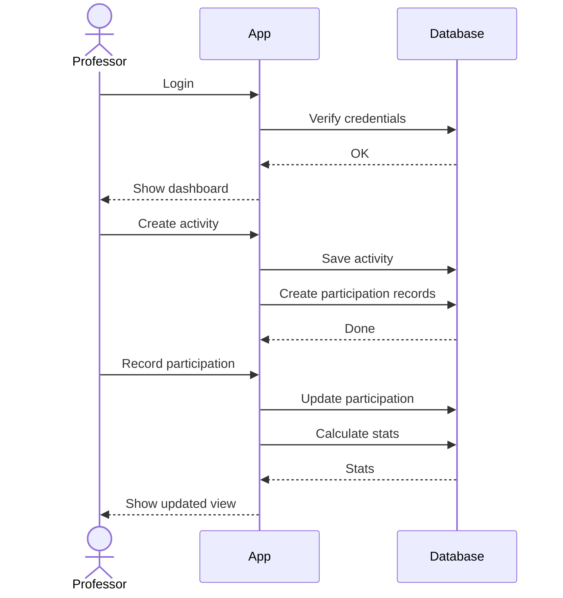

# Gestion des Activités Pédagogiques

A simple desktop app to manage classroom activities and track student participation. Built with Java Swing and Hibernate.

## What does it do?

This app helps professors organize their teaching activities - creating assignments, tracking who participated, grading students, and getting some stats on how things are going. Nothing fancy, just the basics done right.

## Demo

https://github.com/user-attachments/assets/fbcae29f-623d-42d9-b909-4f74a679b045

## Quick Start

You need Java 21 and Maven installed. Then:

```bash
# Compile and run
mvn clean compile
mvn exec:java
```

Login with:
- Username: `admin`
- Password: `admin123`

The app will create a local H2 database in your home folder and populate it with some test data so you can play around.

## How it works



## Database Schema



## Features

### What's working:
- **Login system** - BCrypt password hashing, session management
- **Activity management** - Create lectures, projects, quizzes, exams, etc.
- **Student records** - Keep track of student info and enrollment
- **Participation tracking** - Who showed up, who did the work
- **Grading** - Add scores and feedback
- **Search & filters** - Find what you need quickly
- **Statistics** - See participation rates and average scores
- **Charts** - Pie charts and bar graphs using JFreeChart

### Activity workflow:



## Project Structure

```
src/main/java/com/fst/gestionactivites/
│
├── GestionActivites.java              # Entry point
│
├── model/                             # Database entities
│   ├── User.java                      # Login accounts
│   ├── Student.java                   # Student records
│   ├── Activity.java                  # Activities (lectures, quizzes, etc)
│   └── StudentParticipation.java     # Who participated + grades
│
├── repository/                        # Database queries
│   ├── UserRepository.java
│   ├── StudentRepository.java
│   ├── ActivityRepository.java
│   └── ParticipationRepository.java
│
├── service/                           # Business logic
│   ├── AuthenticationService.java    # Login/logout
│   ├── EmailService.java             # Password reset emails
│   └── DataInitializationService.java # Test data
│
├── data/
│   └── DatabaseManager.java          # JPA setup
│
└── gui/                               # Swing UI
    ├── LoginDialog.java
    ├── MainFrame.java
    └── pannels/
        ├── ActivitiesPanel.java       # Activity CRUD
        ├── ActivityDialog.java
        ├── StudentPanel.java          # Student management
        ├── StudentDialog.java
        ├── ParticipationPanel.java    # Track participation
        ├── ParticipationDialog.java
        └── StatisticsPanel.java       # Charts & reports
```

## Tech Stack

- **Java 21** - because why not use the latest LTS
- **Swing** - yeah it's old school, but it works
- **Hibernate 6.4** - ORM magic for database stuff
- **H2** - embedded database, perfect for dev
- **JFreeChart** - for those nice looking graphs
- **BCrypt** - password hashing done right
- **FlatLaf** - makes Swing look decent in 2024
- **Maven** - dependency management

## Configuration

### Database

By default, it uses H2 and stores data at `~/gestionactivites.mv.db`.

Want to use MySQL instead? Edit `src/main/resources/META-INF/persistence.xml`:

```xml
<property name="jakarta.persistence.jdbc.url"
          value="jdbc:mysql://localhost:3306/gestionactivites"/>
<property name="jakarta.persistence.jdbc.user" value="root"/>
<property name="jakarta.persistence.jdbc.password" value="your_password"/>
```

### Email Setup

Password reset emails are disabled by default (they just log to console). To enable real emails, edit `EmailService.java` and configure your SMTP server.

## User Flow



## What's in the test data?

When you first run it, the app creates:
- 15 fake students (Ahmed, Fatima, Mohamed, etc.)
- 12 sample activities (lectures, quizzes, projects)
- Participation records for all students
- Some random grades to make it look real

## Tips

- Search works on activity titles and student names
- Filters are cumulative (you can combine type + status)
- Double-click table rows to edit
- Stats refresh automatically when you change data
- The database file can be deleted to reset everything

## Known Issues

- No user registration UI (use the default admin account)
- Email service needs manual configuration
- No export to Excel/PDF (yet)
- Swing can feel sluggish on some systems

## License

Academic project for FST. Feel free to use it for learning.

## Contributing

This is a class project, but if you find bugs or have ideas, go ahead and fork it.
